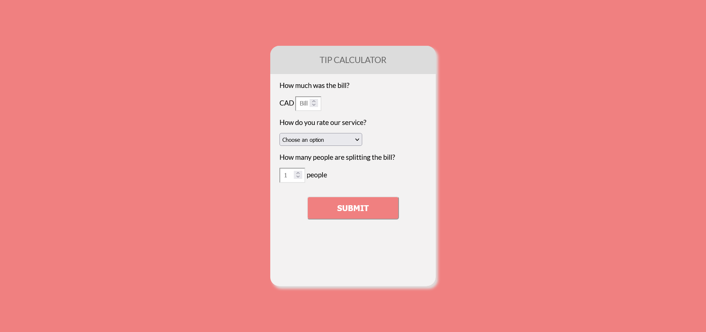

# Tip-calculator

## Project

This project is a simple application that allows users to calculate the tip amount and the total bill amount based on the service quality and the number of people sharing the bill.

This project is part of the["Start na Programação" (or a _QuickStart to programming_)](http://start.onebitcode.com/) offered by [OneBitCode](https://onebitcode.com/lp/).

## Technologies used

- HTML
- CSS
- JavaScript

## Where can I see it?

See it [HERE](https://samylecarvalho.github.io/tip-calculator/).

---
